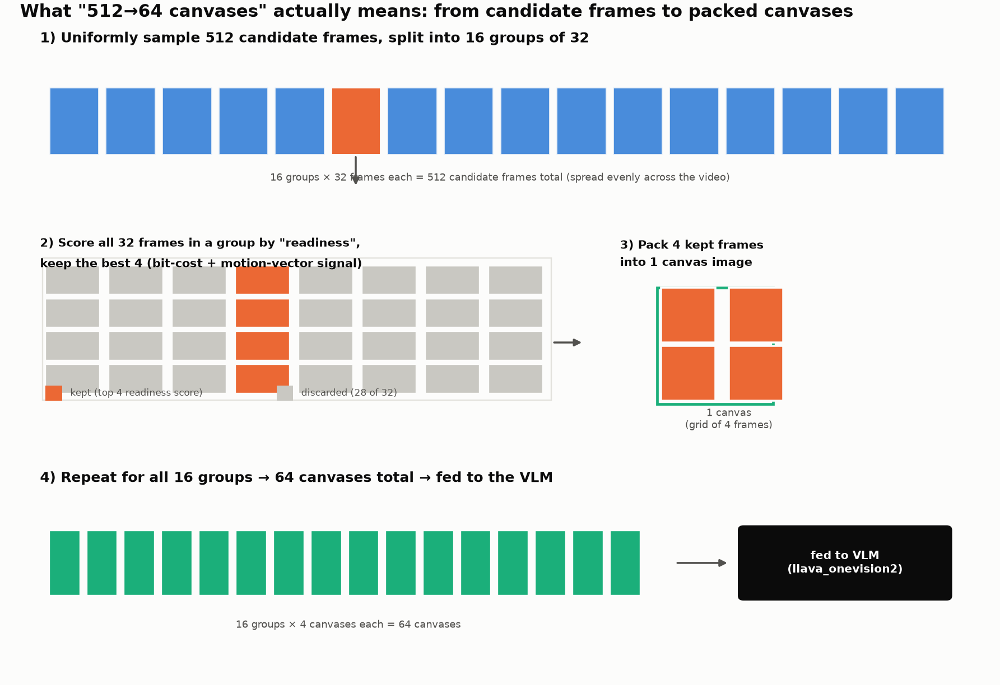
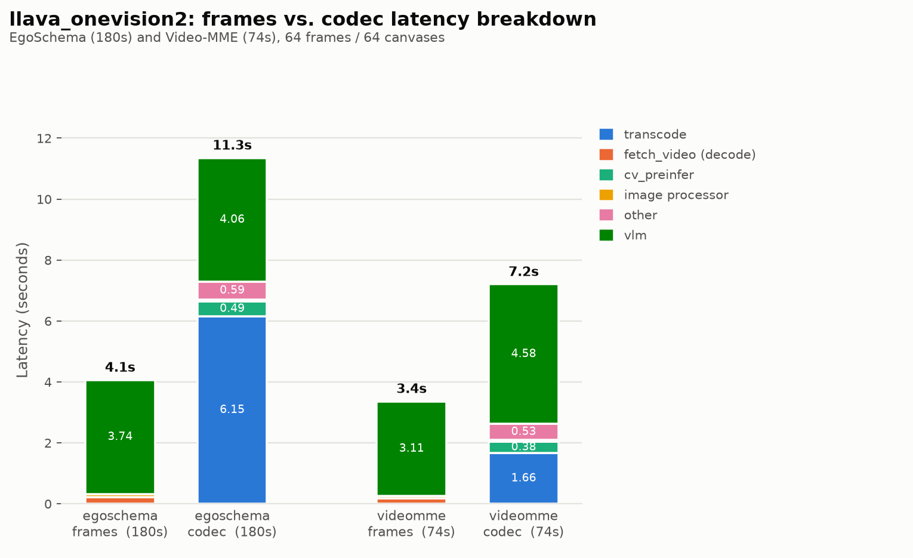

# Frames vs. codec: does `llava_onevision2` run, and is codec worth it?

`llava_onevision2` feeds video two ways: **`frames`** (sample 64 evenly)
or **`codec`** (a separate tool, `cv-preinfer`, picks the 64 "best"
frames from H264 encoding signals). Ran both on EgoSchema (500 videos)
and Video-MME (1395 questions), Docker setup from `README.md`, 1 A100.

## TL;DR

**Codec is 6-7x slower end-to-end for basically no accuracy gain.**

| Dataset | Backend | n | Accuracy | Tokens | Transcode | cv_preinfer | image_proc | other | ViT | LLM | **E2E** |
|---|---|--:|--:|--:|--:|--:|--:|--:|--:|--:|--:|
| EgoSchema | frames | 500 | 69.4% | 11760 | 0.00s | – | 0.09s | 0.02s | n/a | n/a | **3.81s** |
| EgoSchema | codec | 500 | 69.6% | 11925 | 6.26s | 11.05s | 0.06s | 0.54s | n/a | n/a | **22.46s** |
| Video-MME | frames | 1395 | 62.2% | 8998 | 0.00s | – | 0.08s | 0.02s | 0.02s* | 3.42s* | **3.26s** |
| Video-MME | codec | 1395 | 63.2% | 9955 | 7.53s | 10.32s | 0.05s | 0.55s | 0.03s* | 4.25s* | **22.47s** |

\* Partial: ViT/LLM instrumentation landed mid-run, so these cells cover
only 26-27/1395 Video-MME samples (EgoSchema: none). Can't backfill —
timing the forward pass needs a real re-run of all 3790 units.

Accuracy moves ~0.2-1.0 points either way — noise, codec buys nothing.
Two things drive the latency gap: **transcode** (`cv-preinfer` needs
H264/HEVC, so codec `ffmpeg`-converts our `mpeg4` sources first — skipped
if already H264/HEVC) and **`cv_preinfer` itself** (frame-selection,
below), the bigger cost at 10-11s/video.

## What "512→64 canvases" actually means



`cv-preinfer` (package `codec-video-prep-legacy-exact`) is a separate
tool this repo shells out to for picking — the model never sees the
discarded frames. One call:

1. Uniformly samples **512 candidate frames**.
2. Scores each for "readiness" from **bit-cost and motion-vector data
   read straight from the H264 bitstream** — no pixel decode needed to
   score, hence the H264/HEVC-only requirement.
3. Keeps the best **64 frames** (4 of every 32-frame group), fully
   decodes only those. Each kept frame becomes its own canvas — one
   frame per canvas, not a multi-frame collage.

**Not the LLaVA-OneVision-2 companion paper's method** — same idea
(reuse the codec's own compression decisions), different mechanism.
Checked against the paper ([*OneVision-Encoder: Codec-Aligned
Sparsity*](https://arxiv.org/abs/2602.08683)) and its
[official code](https://github.com/EvolvingLMMs-Lab/OneVision-Encoder):
it sparsifies **patches within frames** using **HEVC** (I-frames kept
whole, P-frame patches pruned to a fixed budget — no frame ever fully
dropped); `cv-preinfer` drops **whole frames** using **H264** (64 of
512), sharing no code/terminology with the paper.

**Quirks:**
- `cv_preinfer` cost is **not duration-independent** — one cherry-picked
  video looked flat (~0.5s), but real datasets average 20-25x higher
  (10-11s), with a lot of sample-to-sample variance.
- The 512-candidate count barely shrinks with video length (only under
  ~17s), so scanning still gets slower on longer videos even though the
  final canvas count stays 64.
- `--num-frames` only controls the `frames` path — codec's size is set
  separately via `--codec-target-canvas`.
- `ffmpeg` and `decord` do two unrelated decodes: `ffmpeg`
  re-encodes `mpeg4`→H264 for codec's transcode step, `decord` decodes
  the original `mpeg4` for frames' `fetch_video` step.

(Single-video numbers below are illustrative, n=1 — the table above,
from the full 500/1395-sample run, is the real comparison.)

<details>
<summary>Single-video micro-benchmark (2 videos, for sanity-checking the mechanism above)</summary>

| Sample | Dur | Backend | Frames | Tokens | Transcode | fetch_video | cv_preinfer | image_processor | other | VLM | **E2E** |
|---|--:|---|--:|--:|--:|--:|--:|--:|--:|--:|--:|
| egoschema | 180s | frames | 64 | 12288 | 0.00s | 0.22s | – | 0.10s | – | 3.74s | **4.06s** |
| egoschema | 180s | codec | 512→64 canvases | 12288 | 6.15s | – | 0.49s | 0.06s | 0.59s | 4.06s | **11.36s** |
| videomme | 74s | frames | 64 | 9216 | 0.00s | 0.18s | – | 0.07s | – | 3.11s | **3.36s** |
| videomme | 74s | codec | 512→64 canvases | 11520 | 1.66s | – | 0.38s | 0.05s | 0.53s | 4.58s | **7.21s** |



Bigger/longer videos cost more to transcode, not just proportionally —
ffmpeg touches every pixel, so a video 2.4x longer but also a bit
taller cost 3.7x more here.

</details>

## Why this can't run on GB200 (aarch64)

Not a model/GPU restriction — `transformers`/`torch`/CUDA run fine on
GB200. Two auxiliary tools only ship precompiled x86_64 binaries:

- **`decord`** (frames): no Linux aarch64 wheels. Source **is** public
  ([dmlc/decord](https://github.com/dmlc/decord)), so a from-source
  build is plausible — not attempted here.
- **`codec-video-prep-legacy-exact`** (`cv-preinfer`): installs on
  aarch64 but fails at runtime (`RuntimeError: cv_reader.read_video_cb
  not available`) — no native backend, and **no source distribution
  exists anywhere**. Genuine dead end.

Codec has no viable public path on GB200; frames might, with effort.
All numbers above are from a single A100 (x86_64).

<details>
<summary><b>Reproduce</b></summary>

Data: `<DATA_ROOT>/egoschema/subset.json` + `.../video_mme/questions.json`
matched against local video files (default `DATA_ROOT`:
`/home/thannan/scratch/AutoGaze/data`).

```bash
salloc --partition=A100x2 --nodes=1 --gres=gpu:1 --time=08:00:00 sleep 28800 &
JOBID=<id from squeue -u $USER>   # --jobid reuse avoids re-queueing per run

srun --jobid=$JOBID bash -c '
    cd /home/scratch.thannan_wwfo/LLaVA-OneVision-2/lmms-eval
    docker build -t lmms-eval-ov2:latest -f dockerfile/Dockerfile .
    mkdir -p /home/thannan/scratch/hf_cache
    docker run --rm --gpus all --ipc=host --shm-size=16g --network=host \
      --user $(id -u):$(id -g) -e HOME=/tmp \
      -v $(pwd):/workspace/lmms-eval \
      -v /home/thannan/scratch/hf_cache:/hf_cache \
      -v /home/thannan/scratch/AutoGaze/data:/data \
      -e HF_HOME=/hf_cache -e LLAVA_CODEC_ONLINE_TUNED=1 \
      lmms-eval-ov2:latest bash -c "
        export PATH=/tmp/.local/bin:\$PATH
        cd /workspace/lmms-eval
        pip install --user -e . --no-deps -q
        python3 -m pip install --user -q \
            --index-url https://test.pypi.org/simple/ \
            --extra-index-url https://pypi.org/simple/ \
            codec-video-prep-legacy-exact==0.2.5.post2
        python3 examples/llava_onevision2_repro/run_dataset_eval.py \
            --data-root /data --backends frames,codec
      "
'
```

Non-obvious flags: `--partition=A100x2` not `gb200nvl72_preprod`
(aarch64 lacks `decord`/`cv-preinfer`; it's just the partition's name,
`--gres=gpu:1` still requests only 1 GPU); `--user $(id -u):$(id -g)
-e HOME=/tmp` (NFS root-squash blocks root writing the mount); `-e
LLAVA_CODEC_ONLINE_TUNED=1` (routes to the pinned
`codec-video-prep-legacy-exact` CLI instead of the README-forbidden
`codec-video-prep`).

`run_dataset_eval.py` checkpoints to JSONL and resumes automatically —
safe to re-run after a SLURM timeout. Single-video variant:
`run_single_video.py --data-root /data --num-frames 64 --backends
frames,codec --codec-target-canvas 64`.

</details>
